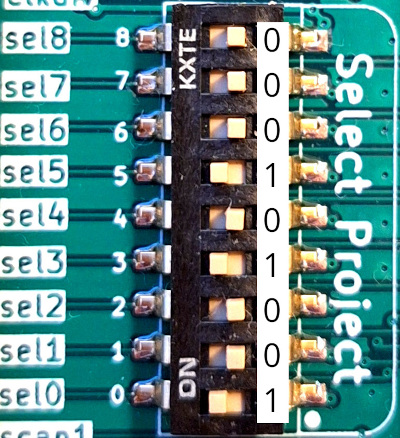

# Tinytapeout 02 bringup
The installation (bring-up) of Project 41 inide the Tinytapeout 02 chip and board.

## Links
[TT02 overview page](https://tinytapeout.com/runs/tt02/)

[Project 41 on TT02: 8x8 Memory Player](https://tinytapeout.com/runs/tt02/041/)

[Design of 8x8 Mem Player in Wokwi](https://wokwi.com/projects/341620484740219475)

[GitHub repo containing the GDS of the 8x8 Mem Player](https://github.com/ThorKn/tinytapeout02_pattern_player)


## Setup
__Important:__ There is an __error in the documentation__ of this project (P41 - 8x8Bit Pattern Player). The official TT02 docs and the pdf have the first two pins in the wrong order. Pin IN0 is clk_sr and Pin IN1 is data.

Wire the RasPi and the TT02 Board with 4 jumper cables like in this table:
| RasPi pin | TT02 Board Input pin | Signal Name |
|-----------|----------------------|-------------|
| GPIO 18, Pin 12 | Pin IN 1  | datapin |
| GPIO 21, Pin 40 | Pin IN 7  | playclockpin |
| GPIO 23, Pin 16 | Pin IN 0  | clockpin |
| GND, Pin 20 | GND | GND |

Configure the mode of the chip (Pin IN5) as a player. For this bit the dip-switches on the TT02 can be used. 

You can see the dip-switches and cable connections in these pictures:




## Programm the Memory
Upload the python script ```p41_prog.py``` to the RasPi and run it with 

```python p41_prog.py```. 

The bitarray (64 Bits) gets shifted into the 8x8 Bit memory inside the TT02 chip. The first Bit in the array will be the last Bit in the memory (think about this! It is natural with serial shifting).

## Play the Memory
Upload the python script ```p41_play.py``` to the RasPi and run it with 

```python p41_play.py```. 

You should see the letters of THORSTEN displayed one after another on the 8-segment display of the TT02 board.

## Challenges
1. Put your own word into the chip and play it.
2. Write another python script to use the adress lines (3 Bit) of the 8x8 memory instead of the player. You must wire addition three cables and switch the mode switch to use addresses.
3. Connect some other device to the output pins. Maybe a 8-Bit R2R DAC (digital-analog converter made from resistors) and make some sounds with the chip.

